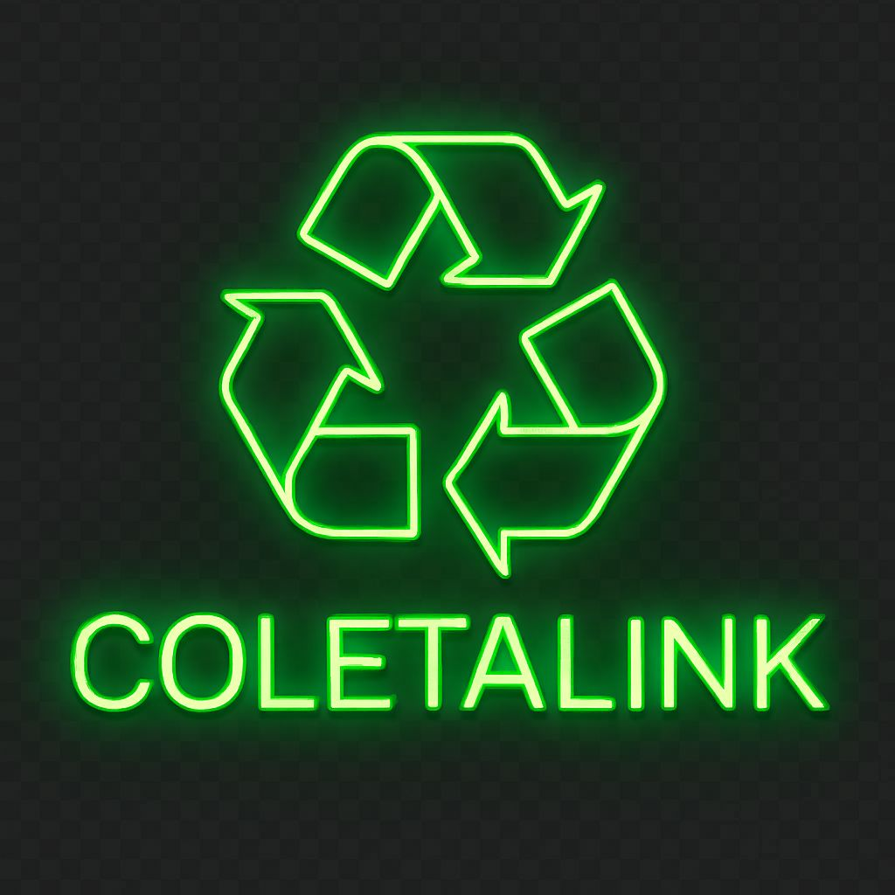

# ♻️ ColetaLink

**ColetaLink** é uma plataforma digital criada para facilitar o descarte consciente de resíduos sólidos, conectando moradores a pontos de coleta e catadores de forma prática, geolocalizada e responsiva.

> 🌱 Projeto Integrador • Eixo Computação - Univesp 2025;  
> 💡 Foco em sustentabilidade, impacto social e tecnologia acessível.

---

## 📸 Visão Geral

<p align="center">
  
</p>

---

## ⚙️ Funcionalidades

- 📝 Cadastro de pontos de coleta (CEP + formulário completo)
- 🗺️ Mapa interativo com ícones personalizados via Leaflet
- 🔎 Filtros por nome, cidade, bairro e tipo de resíduo
- 📬 Busca por CEP com centralização dinâmica no mapa
- 📱 Layout responsivo com menu hambúrguer moderno
- 🎨 Visual temático: cimento queimado + verde neon

---

## 🧱 Tecnologias Utilizadas

| Front-end        | Back-end          | Banco de Dados |
|------------------|-------------------|----------------|
| React + Vite     | Node.js + Express | MongoDB Atlas  |
| SCSS Modules     | Axios             | Mongoose       |
| React Router DOM | CORS + dotenv     |                |
| React Leaflet    |                   |                |

---

## 🧪 Como Executar Localmente

### 1️⃣ Clonar o Repositório

```bash
git clone https://github.com/Audreysilverio/coletaLink.git
cd coletaLink
```

---

### 2️⃣ Instalar Dependências

#### 🔷 Front-end

```bash
cd frontend
npm install
npm run dev
```

#### 🔶 Back-end

```bash
cd backend
npm install
node server.js
```

---

### 3️⃣ Configurar o `.env` no Back-end

Crie um arquivo `.env` dentro da pasta `backend` com o conteúdo:

```env
MONGO_URI=sua_string_de_conexao_mongodb_aqui
PORT=5000
```

⚠️ **Importante:**  
- Nunca exponha sua `MONGO_URI` publicamente.  
- Certifique-se de que o arquivo `.env` está listado no `.gitignore`.

---

## 🌐 Deploy

| Camada     | Plataforma                           |
|------------|--------------------------------------|
| Front-end  | [Vercel](https://coleta-link.vercel.app) |
| Back-end   | [Render](https://coletalink-api.onrender.com)         |

---

## 🤝 Contribuindo

Contribuições são muito bem-vindas!

```bash
# 1. Faça um fork
# 2. Crie sua branch: git checkout -b minha-feature
# 3. Commit: git commit -m "feat: nova funcionalidade"
# 4. Push: git push origin minha-feature
# 5. Abra um Pull Request 🚀
```

---

## 📄 Licença

Este projeto está licenciado sob os termos do **MIT**.
